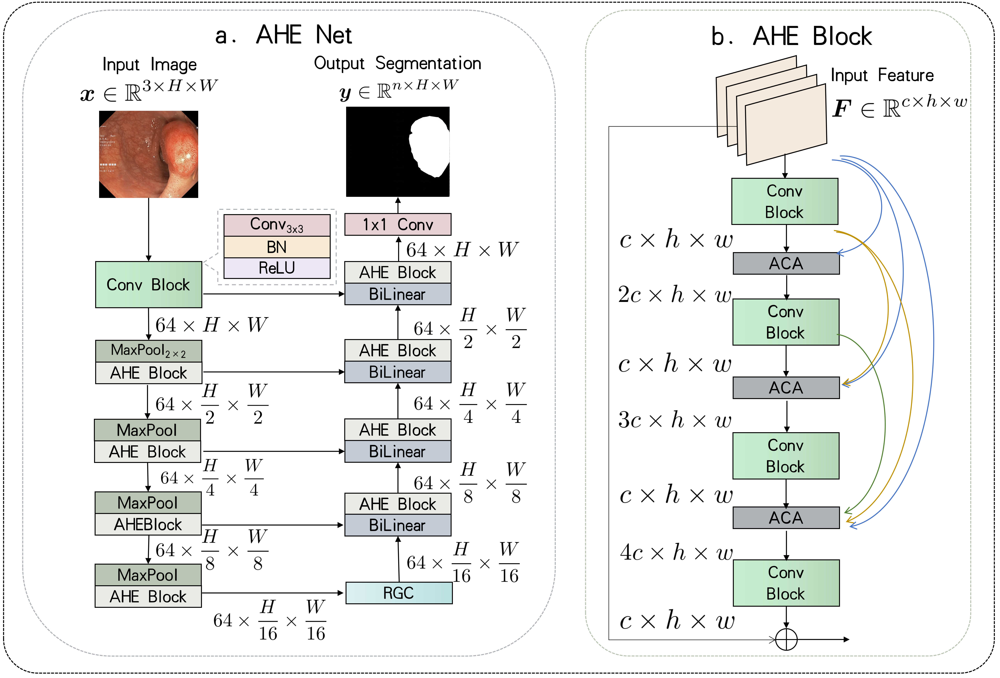
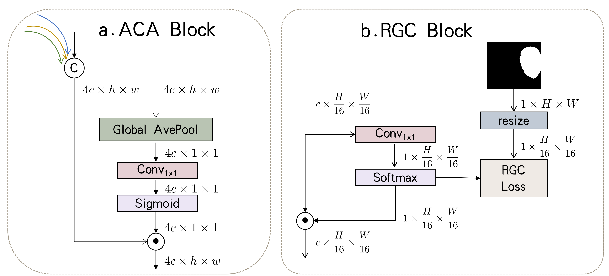

# AHENet
<p align="left">
    
</p>
<p align="left">
    
</p>


This repo holds the pytorch implementation of AHENet:<br />

**Adaptively Hierarchical Feature Enhancement
Network for Biomedical Image Segmentation**


## Requirements
Python 3.7.6<br />
PyTorch==1.7.1<br />

## Usage

### 0. Dataset Preparation
Before starting, we should collect the following datasets.

Datasets | Data source
--- | :---:
CVC-ClinicDB | [data](https://www.kaggle.com/datasets/balraj98/cvcclinicdb)
CVC-ColonDB | [data](https://drive.google.com/file/d/17Y_eAnni1vZzciNNvykiqT62jOlUg-pC/view?usp=sharing)
ETIS | [data](https://drive.google.com/file/d/1prHdvq3TNY1f0FCkjC1hZo36OGA1qLt7/view?usp=sharing)
Kvasir | [data](https://datasets.simula.no/kvasir/)
GLaS | [data](https://warwick.ac.uk/fac/cross_fac/tia/data/glascontest/download/)
MoNuSeg | [data](https://drive.google.com/file/d/1ZgqFJomqQGNnsx7w7QBzQQMVA16lbVCA/view)
Synapse | [data](https://www.synapse.org/#!Synapse:syn3193805/wiki/89480)
ISIC2018 | [data](https://drive.google.com/file/d/1hqX_qm-0BZvARshvjPAlm08Miu7AKuAm/view?usp=sharing)
PanNuke | [data](https://jgamper.github.io/PanNukeDataset/)


* Download and put these datasets in `dataset/`. 
* Save the data directories in `train.txt`, `test.txt`
* The folder structure of dataset should be like

dataset/0123456_spacing_same/
    ├── 0Liver
    |    └── imagesTr
    |        ├── liver_0.nii.gz
    |        ├── liver_1.nii.gz
    |        ├── ...
    |    └── labelsTr
    |        ├── liver_0.nii.gz
    |        ├── liver_1.nii.gz
    |        ├── ...
    ├── 1Kidney
    ├── ...
    

    ├── CVC-ClinicDB
    |    └── image
    |        ├── 1.png
    |        ├── 2.png
    |        ├── ...
    |    └── label
    |        ├── 1.png
    |        ├── 2.png
    |        ├── ...
    |    └── train.txt
    |    └── test.txt
    ├── CVC-ColonDB
    ├── ...

### 1. Training
* cd `GCBLoss/' and run 
```python
CUDA_VISIBLE_DEVICES=0 python train.py
```
### 2. Results
The training results save in `weights/`

### 3. Visualization
* cd `GCBLoss/' and run 
```python
CUDA_VISIBLE_DEVICES=1 python test.py
```
The visual results save in `GCBLoss/vis`
